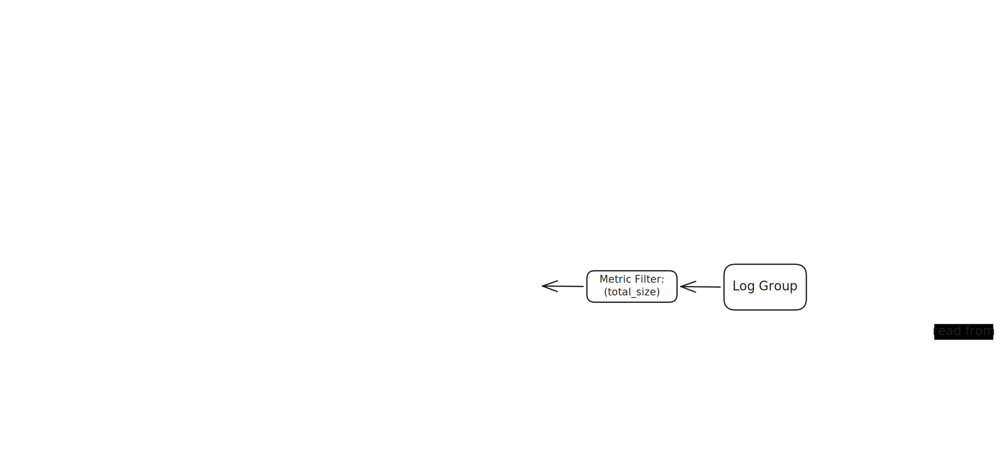

## Overview

This project is an event-driven AWS serverless system that monitors the total size of objects in an S3 bucket, automatically removes the largest object when the bucket reaches a threshold, and generates a final plot showing how bucket size changes over time.

It is a compact but complete example of how to combine `S3`, `SNS`, `SQS`, `Lambda`, `DynamoDB`, `CloudWatch`, and `API Gateway` into one end-to-end workflow.

This project demonstrates:

- event-driven system design
- asynchronous processing with decoupled consumers
- state tracking in a distributed workflow
- log-based monitoring and automated remediation
- practical tradeoffs between correctness, simplicity, and observability

## Summary

I built this project to show how a small but realistic serverless system can be designed around asynchronous events instead of direct function-to-function calls.

The system starts with S3 object events, fans them out through `SNS` and `SQS`, tracks current object state and historical state in `DynamoDB`, and uses `CloudWatch` metrics plus an alarm action to trigger automatic cleanup when the bucket reaches a size threshold.

What makes this project useful in an interview is not just the list of AWS services. It shows that I understand:

- why `SNS + SQS` is better than tightly coupling everything to direct S3 triggers
- how to separate state management from observability
- how to model both current state and historical state in DynamoDB
- why an alarm metric should reflect business meaning, not just raw event deltas
- how real runtime behavior can differ from the ideal architecture because of monitoring windows and asynchronous processing

## Tech Stack

`Python, AWS CDK, Lambda, S3, SNS, SQS, DynamoDB, CloudWatch Logs, Metric Filters, CloudWatch Alarms, API Gateway, Matplotlib`

## Architecture

The system is built around one S3 event flowing through two independent processing paths.

### High-level flow

1. `Driver Lambda` uploads objects into `TestBucket`
2. `S3` publishes object events to an `SNS` topic
3. `SNS` fans out the same event to two `SQS` queues
4. `Tracking Queue` feeds `Size Tracking Lambda`, which updates current state and history in `DynamoDB`
5. `Logging Queue` feeds `Logging Lambda`, which writes structured event logs into `CloudWatch Logs`
6. `Size Tracking Lambda` also emits `total_size` logs into its own log group
7. `Metric Filter` extracts `total_size` from the `Size Tracking Lambda` log group
8. `CloudWatch Alarm` invokes `Cleaner Lambda` when the threshold is reached
9. `Cleaner Lambda` deletes the largest current object
10. `Driver Lambda` calls `API Gateway`
11. `Plotting Lambda` reads history from `DynamoDB`, generates a PNG, stores it in `PlotBucket`, and returns it through the API

The diagram is intentionally high-level. In the actual code, the cleanup alarm is driven by `total_size` logs produced by `Size Tracking Lambda`, not by the `Logging Lambda` path.

## Why This Design

### Why `SNS -> SQS -> Lambda`

The point of using `SNS` and `SQS` is to decouple consumers.

One S3 event is processed in two different ways:

- one path updates application state
- one path drives monitoring and cleanup

This design makes the workflow easier to reason about and closer to production-style event pipelines than direct `S3 -> Lambda`.

### Why two queues

The queues separate responsibilities:

- `Tracking Queue` feeds `Size Tracking Lambda`, which owns the DynamoDB state and the final alarm metric
- `Logging Queue` feeds `Logging Lambda`, which keeps a separate structured event log stream

Each Lambda can fail, retry, or scale independently.

### Why `DynamoDB`

The system needs both current state and historical state.

Current state is needed for:

- knowing the latest object sizes
- computing the current bucket total
- finding the largest object to delete

Historical state is needed for:

- reconstructing the timeline
- generating the final plot

## Data Model

The project uses two DynamoDB tables.

### `ObjectTable`

This table stores the current state of objects in the bucket.

It contains:

- one item per object
- object name
- current object size
- bucket name
- last update time

It also stores one special state row:

- `object_name = "__STATE__"`

That row holds the current total size of the bucket.

This table also has a `GSI` used by the cleaner:

- partition key: `bucket_name`
- sort key: `size`

That index allows the system to find the current largest object efficiently.

### `HistoryTable`

This table stores the timeline of bucket-size changes.

Each history record contains:

- bucket name
- event key
- object name
- event type
- `size_delta`
- `total_size`

This table is the source of truth for plotting.

## Lambda Responsibilities

### `Driver Lambda`

The driver orchestrates one full run of the system.

It:

1. aligns to a CloudWatch evaluation window
2. uploads `assignment1.txt`
3. uploads `assignment2.txt`
4. waits for the first cleanup cycle to complete
5. waits for the alarm to return to `OK`
6. uploads `assignment3.txt`
7. waits for the second cleanup cycle to complete
8. calls the plotting API

This Lambda exists to make the workflow reproducible for testing and demo.

### `Size Tracking Lambda`

This Lambda consumes the tracking queue and maintains system state.

It:

- parses the `SQS -> SNS -> S3` event envelope
- computes state changes for create and delete events
- updates current object size
- updates current bucket total
- appends a history record
- writes the current `total_size` into its CloudWatch log stream

### `Logging Lambda`

This Lambda consumes the logging queue and writes structured event logs to CloudWatch Logs.

In the current implementation, its role is observability rather than alarm generation. It preserves clean event-level logs, including `size_delta`, and looks up the latest positive size when it needs to log a delete event. The cleanup alarm does not read from this log group.

### `Cleaner Lambda`

This Lambda is invoked by a CloudWatch alarm action.

It:

- queries the `ObjectTable` GSI
- finds the largest current object
- deletes that object from the bucket
- logs what was removed

### `Plotting Lambda`

This Lambda reads the history table, generates the final chart as a `PNG`, stores the plot in the plot bucket, and also returns the image through API Gateway.

It is invoked through API Gateway.

## State and Monitoring Logic

Two values matter in the system:

- `size_delta`
- `total_size`

### `size_delta`

`size_delta` is an internal value used to update state and history.

For create events:

- `size_delta = new_size - previous_size`

For delete events:

- `size_delta = -previous_size`

Delete handling is important because S3 delete events do not include object size, so the system must recover that value from stored state.

### `total_size`

`total_size` is the running bucket total after each event.

This is the value used by the monitoring path:

`Size Tracking Lambda -> CloudWatch Logs -> Metric Filter -> CurrentTotalSize -> Alarm`

This was an important design choice.

Using `total_size` as the metric is better than using `size_delta` because the alarm should react to the current bucket total, not to a temporary sum of event deltas in one time window.

### Alarm behavior

The alarm watches:

- custom metric: `CurrentTotalSize`
- statistic: `Maximum`
- threshold: `>= 20`

When the alarm enters `ALARM`, it executes an **alarm action** that invokes `Cleaner Lambda`.

The metric filter is attached to the fixed log group:

- `/aws/lambda/assignment4-size-tracking-lambda`

This is different from a normal Lambda trigger:

- `SQS -> Lambda` uses an event source mapping
- `Alarm -> Lambda` uses an alarm action

That difference is worth understanding because it often comes up in interviews.

## Runtime Behavior

The intended timeline is:

- `0`
- `18`
- `46`
- `18`
- `20`
- `2`

This corresponds to:

1. `assignment1.txt` is uploaded, so the total becomes `18`
2. `assignment2.txt` is uploaded, so the total becomes `46`
3. `Cleaner Lambda` deletes `assignment2.txt`, so the total returns to `18`
4. `assignment3.txt` is uploaded, so the total becomes `20`
5. `Cleaner Lambda` deletes `assignment1.txt`, so the total becomes `2`

The final expected bucket state is:

- only `assignment3.txt` remains

## Tradeoffs and Practical Lessons

The main practical challenge in this project is that CloudWatch alarms evaluate over time windows rather than acting as instant event-by-event triggers.

Because of that, the actual driver code includes waiting logic so the workflow becomes deterministic:

- it aligns to a metric window before starting
- it waits for `assignment2.txt` to be removed
- it waits for the history table to record the expected total
- it waits for the alarm to return to `OK` before uploading `assignment3.txt`

This is a useful systems lesson:

- the architecture can be correct
- the services can be wired correctly
- but orchestration is still needed when the runtime behavior depends on monitoring windows

## Project Bullet Point

- Built an event-driven AWS serverless pipeline that monitored S3 bucket size, automatically deleted the largest object when storage reached a threshold, and generated a final visualization of bucket-size changes over time.
- Designed an `S3 -> SNS -> SQS -> Lambda` fanout architecture so the same object event could drive both state tracking and observability workflows independently.
- Modeled current object state and historical bucket-size changes in `DynamoDB`, using a `GSI` to let the cleaner efficiently identify the largest current object.
- Implemented log-based monitoring with `CloudWatch Logs`, a custom metric, and an alarm action that triggered automated cleanup when the bucket total reached the configured threshold.

## Interview Takeaways

This project is a good example for discussing:

- why fanout architectures are useful
- why queues improve decoupling and reliability
- how to separate state management from monitoring logic
- how to model current state and history in DynamoDB
- why alarm signals should match business meaning
- how to reason about real operational behavior, not just ideal architecture diagrams

Good questions to be ready for:

- **Q: Why use `SNS -> SQS` instead of direct `S3 -> Lambda`?**  
  **A:** It decouples consumers, adds buffering and retries, and lets tracking and logging scale independently.
- **Q: Why separate tracking and logging into two Lambdas?**  
  **A:** State updates and observability are different responsibilities, and separating them makes failures easier to isolate.
- **Q: Why use two DynamoDB tables instead of one?**  
  **A:** `ObjectTable` stores current state and `HistoryTable` stores the timeline, so the split keeps read and write patterns simple.
- **Q: How do you know the size of a deleted object?**  
  **A:** S3 delete events do not include object size, so the system looks up the previous size from `ObjectTable`.
- **Q: Why use `CurrentTotalSize` instead of `size_delta` as the alarm metric?**  
  **A:** The cleanup decision depends on current bucket size, not on the sum of recent event deltas.
- **Q: Why does the actual alarm read from `Size Tracking Lambda` logs instead of `Logging Lambda` logs?**  
  **A:** `Size Tracking Lambda` is where the running total is computed, so it is the cleanest source for the final alarm metric.
- **Q: What is the difference between an event source mapping and an alarm action?**  
  **A:** `SQS -> Lambda` uses an event source mapping that polls the queue, while `Alarm -> Lambda` is an alarm action that invokes the function on a state change.
- **Q: Why does the driver need waiting logic?**  
  **A:** CloudWatch alarms are window-based, so the workflow needs orchestration to make the two cleanup cycles happen in the intended order.
