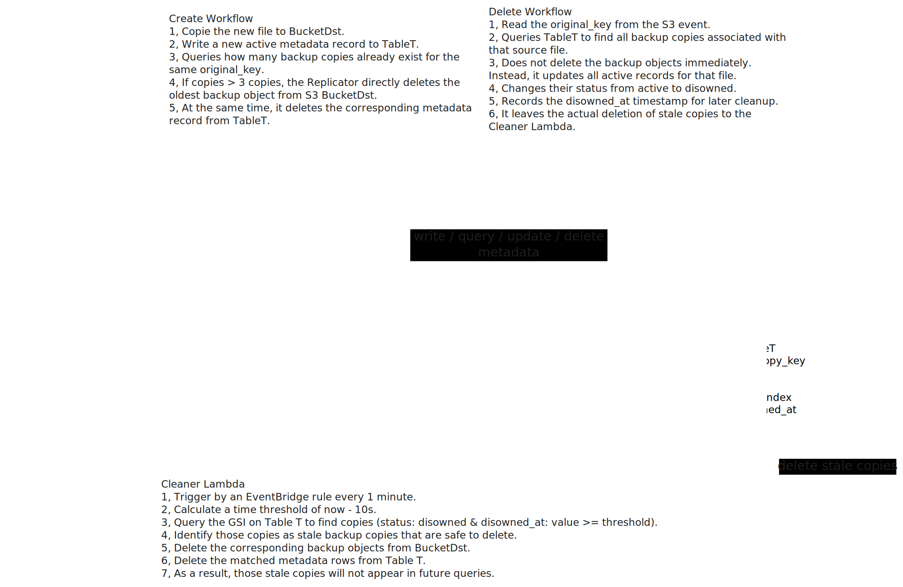

## Overview

This project is an event-driven AWS backup system that listens to `S3` object create and delete events, creates timestamped backup copies in a destination bucket, tracks every copy in `DynamoDB`, and removes stale backup copies through a scheduled cleanup workflow.

It is a compact serverless design, but it covers several production-style concerns at once:

- event-driven replication
- metadata-driven lifecycle management
- delayed cleanup instead of immediate destructive deletes
- DynamoDB access patterns designed around `Query`, not `Scan`
- CDK stack boundaries chosen to avoid circular dependencies

## Summary

I built this project to show that backup logic is not just "copy a file somewhere else." The harder part is controlling the lifecycle of those copies after the source object changes or disappears.

The system uses one source bucket, one destination bucket, one metadata table, one event-driven replication path, and one scheduled cleanup path:

- `BucketSrc` receives the original object events
- `Replicator Lambda` creates backup copies in `BucketDst`
- `TableT` records which backup copies belong to which original object
- `Cleaner Lambda` periodically deletes copies that were marked as disowned long enough ago to be safe to remove

What makes this useful in an interview is that it shows more than service familiarity. It shows that I understand:

- how to model object lifecycle state explicitly
- why delayed deletion can be safer than immediate deletion
- how to design a DynamoDB schema for concrete query patterns
- how to use EventBridge for periodic remediation work
- how CDK stack boundaries can create or avoid deployment cycles

## Tech Stack

`Python, AWS CDK, Lambda, S3, DynamoDB, EventBridge`

## Architecture

The architecture is centered around two workflows: create and delete.

### High-level flow

1. A user uploads or deletes an object in `BucketSrc`
2. `S3` sends a create or delete event to `Replicator Lambda`
3. On create:
   - the object is copied into `BucketDst` using a timestamped `copy_key`
   - a new `active` metadata row is written into `TableT`
   - the system checks how many copies already exist for the same `original_key`
   - if there are more than `3`, the oldest backup copy is deleted immediately
4. On delete:
   - `Replicator Lambda` queries `TableT` for all copies of that original object
   - it does not delete the copies immediately
   - instead it changes their status from `active` to `disowned`
   - it records `disowned_at` for later cleanup
5. `Cleaner Lambda` runs every minute from an `EventBridge` schedule
6. The cleaner queries the `status-disowned_at-index` GSI for disowned copies older than `10` seconds
7. For each matching row, it deletes the backup object from `BucketDst` and removes the metadata row from `TableT`

## Why This Design

### Why copy on create

Create handling is straightforward: a source object still exists, so the system can perform a server-side copy into the destination bucket and immediately register that copy in metadata.

The timestamp suffix in the `copy_key` solves two problems at once:

- every backup copy is unique
- copies are sortable by age, which makes "delete the oldest copy" easy

### Why mark copies as `disowned` on delete

The delete path is intentionally different.

When the original file is deleted, the system does not immediately delete all backup copies. Instead, it marks them as `disowned` and lets the scheduled cleaner remove them later.

That choice matters because it creates a clear lifecycle boundary:

- replication handles source-of-truth changes
- cleanup handles garbage collection

This is a useful systems pattern because it reduces the amount of destructive work done directly inside the event-triggered path.

### Why `DynamoDB`

The backup bucket alone is not enough because `S3` stores objects, not relationships.

The system needs metadata that answers questions like:

- which backup copies belong to this original file
- how many copies of this object exist right now
- which copy is the oldest
- which copies are disowned and old enough to delete

`DynamoDB` fits well here because the system has a small set of very clear key-based access patterns.

### Why split into three stacks

The code is split into:

- `StorageStack`
- `ReplicatorStack`
- `CleanerStack`

The important design choice is that `BucketSrc` lives inside `ReplicatorStack`, not `StorageStack`.

That avoids a CDK circular dependency:

- the replicator needs bucket information to configure the Lambda environment
- the source bucket notification needs the Lambda ARN

Putting `BucketSrc` and `Replicator Lambda` in the same stack removes that deployment cycle.

## Data Model

The project uses one table, `TableT`.

### Primary key design

The table stores one row per backup copy:

| Attribute      | Meaning                                       |
| -------------- | --------------------------------------------- |
| `original_key` | original object name in `BucketSrc`           |
| `copy_key`     | timestamped backup object name in `BucketDst` |
| `created_at`   | creation time in Unix milliseconds            |
| `status`       | `active` or `disowned`                        |
| `disowned_at`  | time when the copy became disowned            |

Primary key shape:

- partition key: `original_key`
- sort key: `copy_key`

This makes the main replication queries simple:

- query all copies for one original object
- count how many copies already exist
- find the oldest copy

### GSI design

The table also defines:

- GSI name: `status-disowned_at-index`
- partition key: `status`
- sort key: `disowned_at`

This index exists for one reason: the cleaner must find stale disowned copies without doing a full table scan.

That is the key interview point in this design. The GSI is not "extra metadata." It directly encodes the cleaner's access pattern.

## Lambda Responsibilities

### `Replicator Lambda`

This Lambda handles both `ObjectCreated` and `ObjectRemoved` events from `BucketSrc`.

For create events, it:

- builds a timestamped `copy_key`
- copies the object from `BucketSrc` to `BucketDst`
- writes a new `active` row into `TableT`
- queries existing copies for the same `original_key`
- deletes the oldest copy if the count exceeds `3`

For delete events, it:

- queries all rows for the deleted `original_key`
- marks active copies as `disowned`
- records a shared `disowned_at` timestamp

### `Cleaner Lambda`

This Lambda is triggered by `EventBridge` every minute.

It:

- computes a threshold of `now - 10 seconds`
- queries the GSI for disowned rows older than that threshold
- deletes the corresponding objects from `BucketDst`
- deletes the matching rows from `TableT`

This makes the cleanup path predictable and keeps the event-driven path focused on state transitions.

## Runtime Behavior

The expected behavior looks like this:

1. Upload `Assignment1.txt`
   - one backup copy is created
   - one `active` row is written
2. Re-upload the same object multiple times
   - each upload creates a new timestamped copy
   - once the count exceeds `3`, the oldest copy is deleted
3. Delete the source object
   - backup copies are not immediately removed
   - their rows are marked `disowned`
4. Wait for the cleaner schedule
   - the cleaner finds disowned copies older than the threshold
   - those copies and rows are permanently deleted

That behavior demonstrates two separate retention rules:

- keep at most `3` backup copies for still-owned objects
- remove stale copies only after they become disowned and old enough

## Tradeoffs and Practical Lessons

The main tradeoff in this project is between simplicity and lifecycle control.

An immediate-delete design would be simpler, but it would mix replication and cleanup into one Lambda path. This implementation deliberately separates them, which makes the object lifecycle easier to explain and reason about.

The other key lesson is schema-driven design:

- the primary key exists for the replicator's query path
- the GSI exists for the cleaner's query path

That is a better DynamoDB story than storing generic metadata first and trying to recover the access pattern later.

## Project Bullet Point

- Built an event-driven AWS serverless backup system that replicated S3 objects into a destination bucket, enforced a three-copy retention rule, and removed stale copies through a scheduled delayed-cleanup workflow.
- Designed a `DynamoDB` schema with `original_key/copy_key` as the primary key and a `status-disowned_at-index` GSI so both replication and cleanup paths could use `Query` instead of `Scan`.
- Implemented the infrastructure in `AWS CDK`, splitting storage, replication, and cleanup into separate stacks while avoiding the circular dependency created by S3 event notifications.

## Interview Takeaways

This project is useful for discussing:

- how to model backup object lifecycle state
- why delayed cleanup can be safer than immediate deletion
- how to design DynamoDB tables from access patterns
- why scheduled remediation is a good fit for EventBridge
- how cross-stack AWS references can create CDK deployment cycles

Good questions to be ready for:

- **Q: Why not delete backup copies immediately when the source file is deleted?**  
  **A:** Separating delete marking from physical cleanup keeps the event path simpler and makes cleanup behavior easier to reason about and schedule.
- **Q: Why use a GSI instead of scanning for disowned copies?**  
  **A:** The cleaner has a precise query pattern, so the index makes cleanup proportional to matching rows instead of total table size.
- **Q: Why timestamp the `copy_key`?**  
  **A:** It guarantees uniqueness and makes oldest-copy selection straightforward.
- **Q: Why does `BucketSrc` live with the replicator stack?**  
  **A:** S3 notifications need the Lambda ARN, and the Lambda needs bucket configuration, so separating them the wrong way creates a circular dependency.
